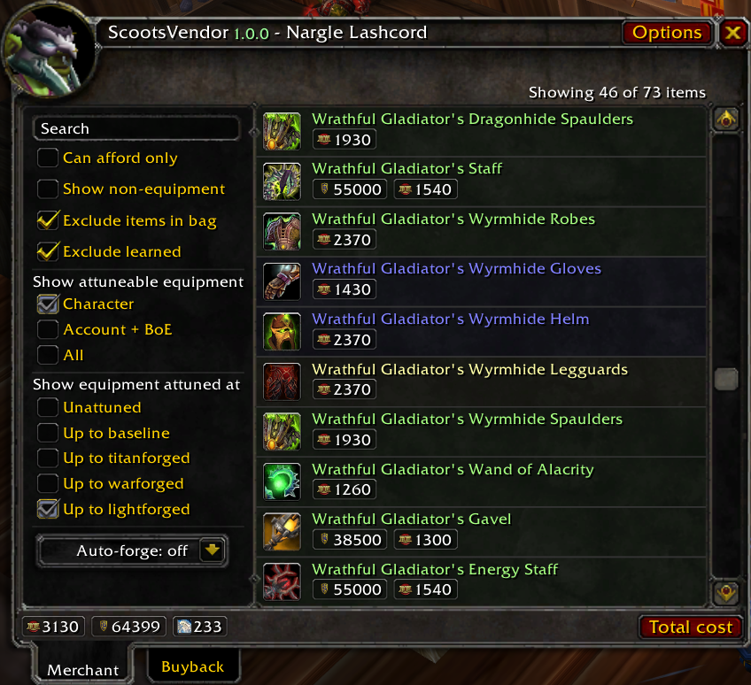
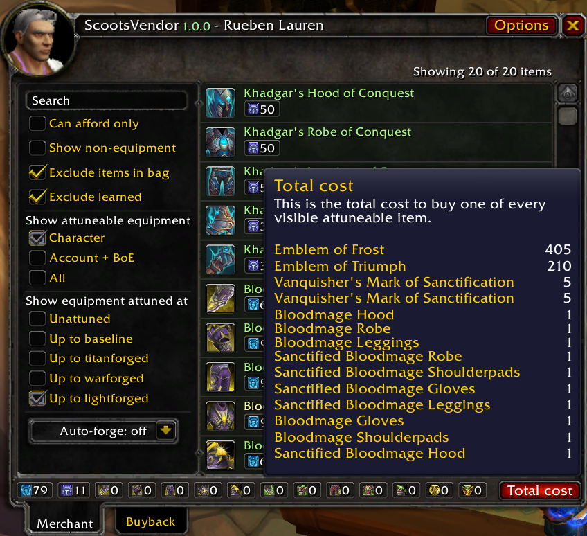
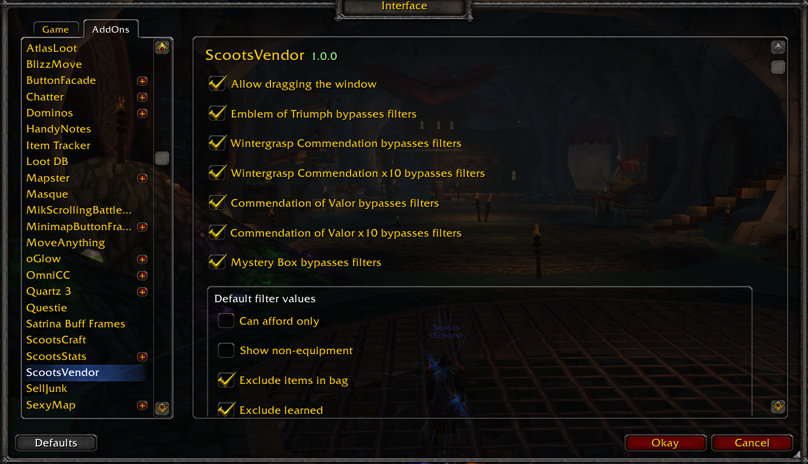

## Description ##

This addon is a from-the-ground remake of the vendor window. This addon has been designed to replace both ScootsVendorFilter and ScootsVendorForge.

Features:

- Filters to quickly find any item you need/want.
- An auto-forge feature.
- Relevant currency displays.
- A display of the total cost to purchase attuneable items.
- Options to always display certain very commonly purchased items.
- A configurable auto-sell feature.

Advantages over ScootsVendorFilter and ScootsVendorForge:

- Filter changes are one click away instead of three clicks away.
- Filters are focussed on attunement rather than simply useable.
- Auto-forge will sell the extra failed attempts on the final purchase of an item.
- Auto-forge process is more efficient so purchases slightly faster with less lag.
- Significantly lower memory usage than either old addon individually.

## Installation ##

Download this repository, then extract the `ScootsVendor` subdirectory from the `src` directory into your `World of Warcraft/Interface/AddOns` directory.

## Screenshots ##

## Support ##

If you'd like to show support for my addons you can use the button below.

Please do not feel obligated to do so - especially if you are not in a financially secure position - and please don't give beyond your means.

